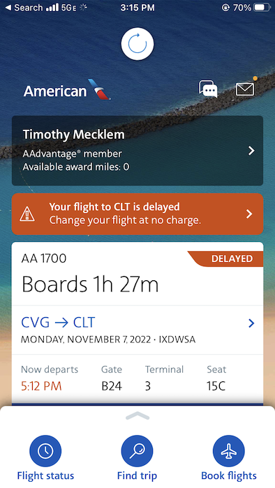

<!--
_class: 'title'
_footer: ''
_backgroundColor: #190641
_color: white
-->
# Designing Real-time Web Apps
##### Tim Mecklem
##### VP of Engineering & Delivery

---

<iframe src="https://wall.sli.do/event/m8rbTQytmGvESi6kW9HjF5?section=97e4b684-b7ed-41cf-9917-b60f4a485ca2" style="height:33rem;"></iframe>

<!-- 
Let's start today's real-time talk with a little real-time poll. What is your primary role in software development?

Any embedded devs? Ok good or uh-oh.

Have to spend the first 30 minutes of the talk arguing about what real-time means. To be clear, this talk
is about building web apps that adapt to data that changes in real-time, not building hard real time
software for specialty hardware and operating systems. If you're here for that, you'll find that despite my IoT experience I'm woefully unprepared for that battle.


Thank you for those answers. This talk has a little something for everyone today, so let's get started!
 -->

---

# Do today's web apps support real-time decisions better than the technologies <br/>they replaced?

<!-- Tim - Approx 2 minutes -->

<!--

Here's a question to ponder

Prior to the web, we already had rich client apps connected to onsite databases that updated information live
Green screen apps connected to mainframes
Was slower hardware, but often more up to the minute information for important decisions

Along comes the web with HTTP and the HTML document format, and we reconditioned ourselves
to a world full of staccato requests and responses, always initiated by the browser client.

And what was initially static webpages became server-side dynamically generated HTML. But it was still
just a static snapshot early on. 

Next slide: But information isn't static.
-->

---

# Information isn't static

<!--
We know data in our systems changes constantly
Inventory changes, 
forum users posting,
emoji reactions flying all over the place
simultaneous document editing

Next slide: Flights get delayed
-->

---

<p style="text-align: center;">
  </img>
</p>


<!--
FAA flight systems go down and planes get grounded because of the lack of realtime data... (too soon?)

It has always been like this, data always moving.

Some apps had to be realtime from the start due to the domain, others have been able to sidestep it.

I've seen evidence we're entering a stage in web product development that users are beginning to expect relevant information to be updated as it changes, not as they request it.

I'm betting you're seeing requests to build realtime features more frequently too.


Next Slide: Our industry has a good problem
-->

---

# We're just catching up to the <br/>capability of our tools

<!-- Tim  Approx 1 minute -->

<!--

Next Slide: Our industry has a good problem.

The exciting news is that web technologies have advanced far enough to support seamless realtime interactions, and we've entered a new period that some emerging tools are up to the challenge.

Fully capable languages and frameworks to solve the real-time needs of our users.

What I've observed in working across business domains with large and small multidisciplinary teams alike
Struggling in the execution of applying technology to improve the experience.

Sometimes we're using modern tools that help us build rich and beutiful frontends with interactivity, but don't really lower the barriers to building realtime features as first-class concerns.
Sometimes we fail to understand the needs of our users and how to support them.

I think most of our difficulties lie in the paradigm shift...

Need new vocabulary for this kind of real-time experience, and today I'll use the phrase "conversation-capable" to describe technology that has first-class support for a constant bidirectional conversation between the information and the user.

But languages and frameworks are only a part of building real-time experiences. Other factors are more important, and they should be driving our decisions about technology.

Next slide: Segue into the takeaway and intros
-->

---

## Tim Mecklem
##### VP of Engineering & Delivery
##### launchscout.com
##### @tim_mecklem (Twitter)
##### timothymecklem (LinkedIn)
##### @tim_mecklem@ruby.social (Mastodon)

<!--

So now is probably a good time to introduce myself and explain why I'm talking to you all about this today.

Tim 

VP of Engineering and Delivery
Worked in enterprise Java, led native mobile teams, and have fallen in love with small mighty teams solving big problems with innovative technology.
20 years of experience

I was around for the first exciting JS part where we learned about XMLHTTPRequest and started to treat JavaScript as more than form validation code
Went through the Douglas Crockford era of "The Good Parts"
excited to talk about this, because we're on the cusp of something as momentous to the web industry as asynchronous json was more than a decade ago.
-->

---

### The takeaway
# Real-time user experiences require<br/><i>full-team</i>, <i>full-stack</i> solutions.
## Corollary:<br/>This is not <i>just</i> a frontend dev or UX designer's problem.


<!--
No matter what you answered on the first poll, this talk is for you.

I don't say that just to keep you in your seat, but because every one of these roles is critical to the success of building these kinds of apps

Real time UX isn't someone else's problem on your team.
Real-time event architectures aren't someone else's problem.
To build these apps, it's an end-to-end problem with everyone working together and 
architecting solutions with the outcome in mind

This is as full-stack a problem as you'll encounter.
 -->

<!--
So, regardless of your role on your team—designer, frontend developer, or backend developer, whatever it may be—don't tune out the stuff today that seems unrelated to your work. It's not. 

Next slide: If web technologies were a step backward in...
-->

---

# The state of real-time web applications

<!--

If web technologies were a step backward in building soft realtime apps, why are we using them?

Let's go back to the fundamentals of what makes the web powerful as the building blocks of our modern tools.

The web as we know it was formed around a request cycle that required the browser to initiate the conversation. 

Request some information, render a response, repeat. 

Added powerful things along the way with javascript, especially this XMLHTTPRequest thing over a decade ago that we hijacked to let us make asynchronous background JSON calls.

Improved CSS to let us build beautifully rich interactions.

Web is this ubiquitous, massive applications without independent installs

But the idea of a server pushing data down to the browser based on events triggered by something other than a request is fairly modern for the web. 
Before websockets, tricks like long-polling to mimic server push.

But the thing is that most modern web tooling, especially for backed web frameworks, assumes this basic request model is still the foundation of everything. 

Server and client technologies are still primarily concerned with routing requests and rendering pages, not with fully utilizing web sockets and other constant conversation methods.

A lot of problems exist becuase of the mismatch of the abstraction between what the web was built upon and what users need and have grown to expect.

With that in mind, let's talk about the principles through some common problems for realtime apps.

Next slide: The first problem we want to highlight today...
 -->

---

### Problem:
# Scarce Resources

<!--

The first problem we want to highlight today is the problem of scarce resources. And this problem is probably most commonly seen in systems that handle inventory management, and an example of how that manifests itself is out of stock situations on commerce sites.

So, let's look at commerce specifically. There is a reality for most e-commerce sites, that customers are interacting with digital representations of a physical inventory. And that means there is a constraint, or a limit, to the number of items that can actually be sold. Take event tickets as an example. There is a limit to the number of tickets that can be sold for an event because there is a physical limit to the number of people who can attend that event.

And it is our job as designers and developers to make sure customers have the right information about the state or status of an item at the right time to make informed decisions about it during the buying process. 

So let's take a look at what that may look like.

Next slide: commerce example
 -->

---

<div style="display: flex; justify-content: space-between; align-items: center;">
<h2>Example - low inventory on a commerce page</h2>
<iframe style="width: 23%; height: 3rem; border: none;" src="/commerce/inventory/scarce-scarf"></iframe>
</div>

<div style="display: flex; gap: 1rem;">
<iframe style="width:45%; height:30rem; border: 3px solid lightgray; border-radius: 10px;"
  src="/commerce/products/scarce-scarf?user_id=11&user_name=Tim"></iframe>
<iframe style="display:inline-block;float:left;width:45%; height:30rem; border: 3px solid lightgray; border-radius: 10px;"
  src="/commerce/products/scarce-scarf?user_id=12&user_name=Katie"></iframe>
</div>

<!--

**Stick the the description of what you're doing, not a lot of narrative.*

Note that there's actually a worse scenario where both succeed but there's only one product to fulfill both orders

Next slide: (Tim) Ok, so let's talk problems

 -->

---

# What are the problems here?

<!--
Tim

Ok so let's talk problems. You probably see the most obvious ones.
* We're soft-committing inventory that we don't have.
* If we don't catch it here, the customer service department has to send a difficult email that we've missed the customer's expectations and have to cancel and potentially refund the order
* The user is at a UX dead end.

Not great!

Those are problems. They are tactical problems. They are our problems, from a business perspective.

But let's step back one level and think about it differently.

How is the user feeling right now? Because what we did was take our problem, and we put it onto the user.

We don't know their motivations or their desires or what they need. Maybe Tim had a very strong sentimental reason to buy that scarf and we did the equivalent of ripping it out of his cart before he could check it out.

What are his options now?

Maybe find a different one. Maybe go somewhere else to buy it. Maybe he doesn't have any options. We certainly left him in a dead end situation in the interface right?

So, while the solution prevents a system problem of two people purchasing the same item, it actually ignores the people problem that it creates by not allowing them to make informed decisions based on accurate information.  

So what does one example of a better solution look like?

Next slide: (Tim) demo of better solution

-->

---
<div style="display: flex; justify-content: space-between; align-items: center;">
  <h2>One potential solution</h2>
  <iframe style="width: 23%; height: 3rem; border: none;" src="/commerce/inventory/rare-raincoat"></iframe>
</div>

<div style="display: flex; gap: 1rem;">
<iframe style="width:45%; height:30rem; border: 3px solid lightgray; border-radius: 10px;"
  src="/commerce/better_products/rare-raincoat?user_id=110&user_name=Parker"></iframe>
<iframe style="width:45%; height:30rem; border: 3px solid lightgray; border-radius: 10px;"
  src="/commerce/better_products/rare-raincoat?user_id=120&user_name=Andrew"></iframe>
</div>

<!-- Tim

Drive the demo of the cart that improves the experience 

Two things to note:
1: Entire system updates to reflect inventory ups and downs
2: User with item in cart has a visual timer to let them know they are on a time limit

Next slide: Why is this better?

-->

---
### Principle
# Value and respect the user's agency

<!--

Why is this better? While there is still a bit of a race condition in that someone's "Add to Cart" button is disabled when they may be moving their cursor to click it, they at least are not able to to move forward in that process under a mistaken belief that they have ahold of that item. We haven't added insult to injury by misleading _and_ disappointing them.

And that other customer knows that they have a set amount of time to decide before they no longer have "dibs" on that item. So, it's really important in these types of situations, to make sure you are exposing the state of the system to the user as changes happen, so that they are able to make intelligent decisions with information.

We want to value and respect the user's agency.

Next slide: Alright, we've talked about systems that manage resources...

-->

---
### Problem:
# Rapid influx of data

<!--
Alright, we've talked about systems that manage resources and making sure that we are exposing the realtime state of those resources to the user. 

There are other types of systems where users benefit from realtime data, as well. And one of the others that we want to highlight today are systems that handle rapidly changing data

things like social media, or a news site, or maybe a polling system, or a dashboard of some sort. 

There are lots of examples of these types of systems. But the problem that presents itself in these systems is that we need to decide how to display the data to the user in a way that is not overwhelming. 

Options: you can forgo it entirely and not worry about updating in real time. Which is bad because then your users don't know if the data their seeing is accurate and could be making a bad decision based on it.

You can decide to display the data coming in in realtime, which then raises the question of how to do that well.

But, let's take a look first:

Next slide: (Tim) social demo
-->

---
<div style="display: flex; justify-content: space-between; align-items: center; margin-bottom: 0;">
  <h2 style="padding-right: 150px; padding-bottom: 30px;">Example</h2>
  <iframe style="height: 4rem; border: none;" src="/social/rate_intensity"></iframe>
</div>

<iframe style="width: 45%; height: 50rem; border: 3px solid lightgray; border-radius: 10px;" src="/social/posts"></iframe>

<!--
(Tim)

**Stick to the literal description**

_Start out slowly with the data rate_

We have here a social media timeline of friends of this user
Four pieces of information: 
friend's username, 
content of the post (They all like Shakespeare!)
location
data science team's relevancy score

This is just a great feed of wonderful content, lots of tragedy quotes, perfect for doomscrolling

Decent rate of information, can read it and stay connected with the whereabout of that Romeo character

But it starts feeling more like a job

But what happens when the garden hose becomes a firehose?

Next slide: What are the problems? So, that seems pretty obvious...
-->

---
# What are the problems here?

<!--

So, that seems pretty obvious, right? In this example, if you decide to just display everything as it comes in, you have to think about how that may work when the influx of data varies. What happens when the data comes in at a slower pace? At a higher pace? Or at a an insanely high pace? There is a threshold where this solution of "just show it to the user" doesn't work. And we have to make sure we identify it and address it. So, how do we do this better?

Next slide: (Tim) demonstration of potential fixes
 -->


---
<div style="display: flex; justify-content: space-between; align-items: center;">
  <h2>One potential solution</h2>
  <iframe style="height:3rem; border: none;" src="/social/rate_intensity"></iframe>
</div>

<div style="display: flex; gap: 1rem;">
  <iframe style="display:inline-block; float:left; width:45%; height:30rem; border: 3px solid lightgray; border-radius: 10px;" src="/social/posts" frameBorder="1"></iframe>
  <iframe style="display:inline-block; float:left; width:45%; height:30rem; border: 3px solid lightgray; border-radius: 10px;" src="/social/better_posts" frameBorder="1"></iframe>
</div>

<!--
(Tim)

I'll share a little secret with you. I shopped this problem around internally, and we struggled to find a really great catchall solution. 

Think about how Facebook solves this problem by curating the list dropp what the algorithm finds less "engaging".

Twitter lets you scratch that chronoligical completionist itch but you have to set aside time on your calendar to get through it all. 

Couple of options

First, we pause the feed if it exceeds more than a post eveery 4-5 seconds. 
This lets you catch up your reading and choose to load the rest.
There are plently of clever ways to do this, including infinite scrolling and paging. Our example keeps it simple with a single button to load the latest

A more interesting solution is to utilize the metadata of the posts.
Explain metadata

The second thing that we did was put some of the filtering control in the user's hands. We allow the user to filter out enything that has lower than a 90% relevancy score.

_Increase rate slider until it's moving too fast even for the relevancy filter_

As you can see, everything has limits, including our solution. Data firehose problems present an especially hard balance to strike to find what the user really needs to be able to do. 

Next slide: Why is this better?

-->

---
### Principle
# Give the user quality over quantity

<!--
Why is this better? This is better because it considers the relationship of the data to the user.

In this example, the posts in are intended to be read. So instead of just displaying all the posts as they come in and pushing everything down to where it's not readable because it is constantly moving

We respect the user's focus and don't replace surprise them by replacing what they're reading on a whim. And like earlier, we also value their agency to decide when to read more of the feed.

We also use our full team's ability, including the data science team's relevancy score to give the user the choice for a better quality feed if they would like. This allows them to build trust with our solution without forcing it upon them.

Like I mentioned earlier, using a pause or a metadata filter might not be the best solution for every firehose type of problem. 

But a key here is that just because you can flip a switch and give your users all the content all the time, it's not always better to do more.

A couple of other options you could do once the content firehose becomes too full:
Try aggregating the metadata in a useful way to break down. You could give meaningful statistics about the feed to allow the user to know what's happening at a high level without forcing them to read everything literally.
You could find creative visualizations of the metadata like the location to help them see geographically where their friends are and alow them to filter based off that visual segmentation.

All of this to say, that when you are displaying realtime data to your users, it's crucial to consider the quality of the experience more than the quantity of event driven things you can show them. Because if you show them the data in realtime in a way that doesn't consider their goals, you're actually going to cause them frustration instead of helping them.

Next slide: But wait there's more!

 -->
 
---

# But wait, there's more!

* Seamless Session Handoff Between Devices
* Collaborative Editing/Drawing
* Handling Disconnects Gracefully
* Managing Notifications Across Multiple Connected Devices
* Dynamic Maps and Location Based Services
* Paging Data
* Integrating IoT and Other Non-web Events

<!--
In our experiences building real-time applications, we've run into a bunch of different problems. These range from managing how to update blockchain explorers with the latest transactions and smart contracts, handling disconnects for users bidding in web auctions, tracking vehicle position data and updating maps, and managing other IoT event data. We don't have time to talk through more examples, but we've got a bunch of experiences to share and we'd love to connect after the talk.
 
Think about session handoff, when to do it and when not. A realtime update of a user's cart when they transition from a site on their phone to their desktop is a delight. A user that has two tabs open of your site and is using the left one to filter data to update things on the right, you don't want those to stay in sync.

One of the apps I use weekly has a bug where the search filter is shared between tabs in the same user session. Which means I can scroll down on a different tab and get paged results from the other tab's updated filter and I get a mess of results that don't make sense. Consider how state is shared in your application, and build mechanisms beyond just the local storage or user session to keep realtime data in sync.


Handle disconeccts in a way that lets people know that the realtime experience they expect from your app isn't what they're getting at the moment. Give them a way to refresh or reconnect and show them the status of the connection.


Notifications across devices is crazy tricky to get right. Consider what things need to show up everywhere immediately, and what things might be better in a batch if there are multiple events coming in that would generate alerts. Everyone has gotten that one app that sends notifications too often. Don't be that app, but do keep your users updated.

Paging Data is a particularly interesting one, because most of us probably consider it "solved". But solved for a realtime app might not look like paging using an offset and a page size. What happens when new information comes in, or even if information is interleaved in the database in a place that changes the window of the current page? You get duplicates or missed rows in the paged data.

A better solution might use a timestamp field and a "last_viewed" index instead of an offset to capture those changes without changing the paging code's assumption of static underlying data.

Treat non-web events the same as web events
-->

<!--
I've been talking a lot about how to best display data in realtime, and it's been heavily focused on the design/front-end side of things. And I told you this is a end-to-end responsibility. So, let's bring it full circle and talk tech.

<!-- Move the slido to the word cloud section -->

---

<iframe src="https://wall.sli.do/event/m8rbTQytmGvESi6kW9HjF5?section=97e4b684-b7ed-41cf-9917-b60f4a485ca2" style="height:33rem;"></iframe>

<!-- (Tim)

But first, a quick poll! We'll hang out here for a minute or so while you add your answers

Thank you for sharing! This is really interesting!

Next slide: (Tim) I had a lot of fun...

-->

---

# Web technologies, revisited

<!--
(Tim)

I had a lot of fun building the slides for this talk, because we chose technologies that support the end-to-end user experience as part of the framework.

Perhaps more interesting is that there isn't a single line of javascript that we wrote to support any of this real-time behavior. 

There's only one templating language for the server and client, and no duplicated logic between frontend and backend layers

Handling click events in the browser is 99% identical to handling events generated from backend actions, in the same context, with the same bidirectional conversation paradigm built into the framework.

Information over the wire is compressed and handled incredibly efficiently in DOM updates

This is powerful. Which leads me to make this case:

Next slide: (Tim) In our case...
-->

---

# The case for something different 

* Elixir, Phoenix, and LiveView
* Ruby, Rails, and Hotwire
* PHP, Laravel, and Livewire
* next.js and SSR React
* .NET and Blazor

<!--
For this talk, I chose Phoenix and LiveView for this demo. There are other approximations to this technology in other stacks.

Without going into the nitty gritty details, the thing that makes LiveView stand out from even the others on this list is its foundation on an Erlang technology called OTP. OTP allows us to have thousands or even millions of tiny lightweight processes holding state and sending each other messages and events, with sophisticated lifecycle management.

Because these processes power the backend business layer as well as each individual conversation with the clients over channels and websockets, the entire system looks a bit different than the typical n-tier architecture. Instead of layer by layer calls and responses, think neurons and synapses where some of those signals travel directly to the browser of every connected user in real-time vs waiting for client-side action.

Okay, I'll end my little love note here and get back on track.

Because I'm not trying to convince you to abandon the things you love. The opposite is true. I'm hoping that this kind of game changing technology can break down the barriers for the monotonous boilerplate and crud so that frontend teams can devote more time in the innovative and creative parts of building frontends.

Next slide: (Tim) Can you build a...
-->

---

# Keys to the technology decision

<!--
Can you build a realtime app with more traditional front and backend technologies that are overwhelmingly popular today? Yes, of course, and to great success.

Is my favorite technology the right choice for every problem at every scale? Of course not. 

But I'm convinced after working with
enterprise stacks
frontend stacks
backend stacks
pancake stacks

Choosing a "conversation capable" solution that combines channels and websockets alongside requests and responses seamlessly is a game-changer that we haven't seen in over a decade since we discovered ajax.

Beyond the technological advances, there's something else that makes adopting something like LiveView a force multiplier.

If Conway's Law is real, which asserts that we tend to build systems and applications that mirror our organization's communication structure... 

then it means that isolated and compartmentalized teams each focusing on their own disciplines tend to create products that include these communication bottlenecks and choke points. There's nothing wrong with having different disciplines, in fact you need that for modern applications.

But if you can choose a technology and form team structures that 
value the end to end experience and 
combine the backend team's knowledge of changing information
with the frontend team's rich interactivity
and closely involve the designers of both the architecture and the user experience...

You get a cohesive application with loose coupling throughout. Not only a more maintainable system, but a better experience all around. 

Pick you a technology that enables your team to work at its best, if you are able to make that decision.

Next slide: (Tim) One final consideration

-->

---
### One Final Consideration
# The Real-time Uncanny Valley

<!--

(Tim)

Okay, let's get hypothetical for a second. You want to transition your app to a real-time experience. There's a pitfall to be aware of.

Let's call this the "Realtime uncanny valley". At some point, without careful planning you will have a app-in-transition, that sometimes feels real-time and sometimes doesn't. This can be confusing for a user. For example, how many of you have encountered this page?
-->

---


<!--
(Tim)

Now I don't claim to be the smartest person on the planet, but I've spent more time staring at this screen than I care to admit.

You create a shiny new repository, and you craft a beautiful first commit message. You dutifully follow the instructions on the screen and you push that perfect commit up to the repo and then... you wait.

Why do you wait? If all of GitHub was one and done rendered pages, you'd know to click the refresh button. But almost all of GitHub is real-time! You submit a PR and _stuff happens_. People comment, CI builds update colors telling you how well your code performed with tests. It's lively, it's dynamic! But not this screen.

It's the uncanny valley. Everything else convinces you that you've got a realtime experience, and then you encounter this non-player character that's staring right past you.

Here's the danger of being in the realtime uncanny valley for too long. 

It erodes the user's confidence that your app is giving them the information they need when they need it.

Losing confidence means loss of trust. Loss of trust means users begin to treat your app as untrustworthy, refreshing pages that are real-time and telling people about the substandard experience. I have an app like this that I use weekly, and I'll guess that you could also come up with one like it if you thought for a minute.
-->
---

### Our advice:
# Avoid the Uncanny Valley
<!--Plan for the transition, communicate clearly to your users, and don't spend long in the uncanny real-time valley.-->

<!-- Move the slido to the feedback section -->

---

<iframe src="https://wall.sli.do/event/m8rbTQytmGvESi6kW9HjF5?section=97e4b684-b7ed-41cf-9917-b60f4a485ca2" style="height:33rem;"></iframe>

---

# Content for this talk
## github.com/tmecklem/realtime-web

## Slides: MARP (marp.app)
## Examples: Phoenix and LiveView (phoenixframework.org)
## Running app: https://realtime-web.fly.dev

---
<!--
_class: 'closing'
_footer: ''
_backgroundColor: #190641
_color: white
 -->

# Questions?
### launchscout.com


---

# Frontend Code!
## Called on SSR and then as client connects via websocket

```elixir
def handle_params(%{"sku" => sku}, socket) do
  # lookup information from database, etc
  user = fetch_user_from_database()
  product = get_product!(sku)

  if connected?(socket), do: InventoryEvents.listen_for_events(product)

  {:noreply,
   socket
   |> assign(:user, user)
   |> assign(:product, product)
   |> assign(:button_state, button_state(user, product))}
end
```

---

# Template

```html
Welcome, <%= @user.name %>
<span style="float: right;">
  <%= link "View Cart", to: Routes.better_cart_show_path(...) %>
</span>

<h1>Products</h1>
<h2><%= @product.name %></h2>
<%= @product.stock_level %> in stock
<p>
  <button style="margin-top: 20px;" phx-click="add_to_cart" 
   disabled={elem(@button_state, 0)}><%=elem(@button_state, 1)%> />
</p>
```

---

# Handling events
## Events are handled similarly regardless of origin

```elixir
  # browser event
  def handle_event("add_to_cart", _value, socket) do
    if BetterCommerce.exclusive_add_to_cart(...) do
      {:noreply, 
        socket 
        |> push_navigate(to: Routes.better_cart_show_path(...))
      }
    end
  end

  # backend event
  def handle_info({:inventory_changed, %Product{sku: sku} = product}, socket) do
    {:noreply,
      socket
      |> assign(:button_state, button_state(socket.assigns.user, product))
      |> assign(product: product)
    }
  end
```

---

# Backend Code!

```elixir
  updated_product = %{product | stock_level: stock_level - 1}

  Repo.update!(updated_product)
  InventoryEvents.notify(sku, :inventory_changed, updated_product)
```

---

# How do I get started with this?

Talk with me!

-- or --

_slightly dated_
Build a real-time Twitter clone in 15 minutes with LiveView and Phoenix 1.5

https://www.youtube.com/watch?v=MZvmYaFkNJI

---

# But will it scale?

Yes.

* https://phoenixframework.org/blog/the-road-to-2-million-websocket-connections
* https://2022.elixirconf.com/speakers/zack-kayser
* https://davelucia.com/blog/observing-elixir-with-lightstep

---


# Thank you!
## Tim Mecklem
##### VP of Engineering & Delivery
##### launchscout.com
##### @tim_mecklem (Twitter)
##### timothymecklem (LinkedIn)
##### @tim_mecklem@ruby.social (Mastodon)
