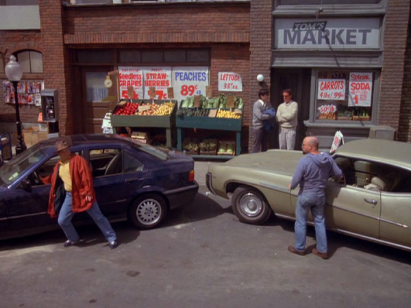
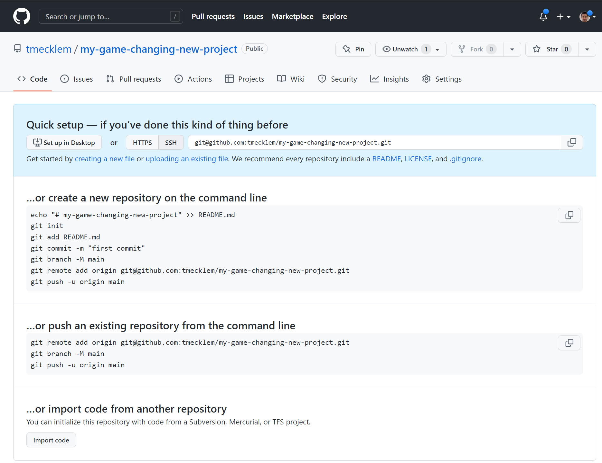

<!--
_class: 'title'
_footer: ''
_backgroundColor: #190641
_color: white
-->
# Designing Realtime Web Apps
##### Katie Pohlman & Tim Mecklem

---

<iframe src="https://wall.sli.do/event/m8rbTQytmGvESi6kW9HjF5?section=97e4b684-b7ed-41cf-9917-b60f4a485ca2" style="height:30rem;"></iframe>

---

# Do today's web apps support real-time decisions better than the technologies  they replaced?

<!-- Tim - Approx 2 minutes -->

<!--

If you look back to pre-web days, many applications were rich client desktop apps that connected to internal servers, or a little further back there were dumb terminals that connected to a mainframe. The apps that ran on these platforms did not have the benefit of running on incredibly fast hardware or utilizing Internet speeds that are 10x of the old internal ethernet networks, but they were often more real-time than the typical web application. The move to web applications and the internet opened up a ton of new possibilities, but it also introduced new constraints, such as the request nature of HTTP and one-and-done rendered pages. We became conditioned to see a snapshot of reality rather than a fluid picture.

But that doesn't mean that information behind the scenes remained static. In fact, nearly every modern web application is built on a mountain of changes that happen constantly. Inventory changes, fulfillment centers take orders and physically assemble them, changing the status as they go. Forum users post new comments, people add emoji reactions to friend's posts. People cllaborate simultaneously on the same documents/records. Some apps handle this rapid change well because the business domain demands it. Some apps have been able to ignore the problem altogether. I'd argue that people's expectations are rising, and a day is coming when web app developers will no longer be able to present static snapshots of realtime information and satisfy users' expectations.

The exciting news is that web technologies have advanced far enough to support seamless realtime interactions, and we've entered a new period that allows us the convenience of writing apps that reflect shift in reality with a similar effort to the days before websockets and push notifications.

-->

---

# We're just catching up to the  capability of our tools

<!-- Tim  Approx 1 minute -->
<!--
Our industry has a good problem. Our languages and frameworks are more capable than they have ever been at giving people up to the second information. Used appropriately, we can use them to help people make better decisions, ease the experience of buying products, and improve interactions with other people. But as a whole, I've observed that teams are struggling in the execution of applying the tech to improve the experience with real-time information.

Sometimes we're stuck using technologies that are less fit to deliver this different paradigm where these rich experiences are first class citizens of the technical architecture. Sometimes we fail to understand the needs of our users and how to support them.

I think most of our difficulties lie in the paradigm shift. We need new vocabulary for this kind of real-time experience, and today I'll use the phrase "conversation capable" to describe technology that has built-in support for a constant bidirectional conversation between the information and the user.

But languages and frameworks are only a part of building real-time experiences. Other factors are more important, because they should be driving our decisions about technology.

-->

---

### The takeaway
# Realtime user experiences require  <u>end-to-end</u> solutions.

<!--
INTROS:

Segue into the takeaway and intros

Katie

Hi! My name is Katie Pohlman and I am a Principal UX Designer at Launch Scout. Launch Scout is a custom software development agency based in Cincinnati, OH. And we build custom web applications for our clients. My role there, as a Principal UX Designer, is two fold—as a member of the Principal Group, I am helping to grow and improve our team's skillset and helping to shape and define what it means to deliver well on projects at Launch Scout. As a UX Designer, I am leading the UX and UI design and then implementing those designs with HTML and CSS. So, I am on the front-end of things, and I'll let Tim introduce himself. 

Tim
VP of Engineering and Delivery
Worked in enterprise Java, led native mobile teams, and have fallen in love with small mighty teams solving big problems with innovative technology.
20 years of experience
excited to talk about this, because we're on the cusp of something as momentous to the web industry as asynchronous json was more than a decade ago.
-->

<!--
(Katie)
Before we dig in, though, there is something that I want to call attention to. As a designer, I know that when we're talking about delivering information in real-time in a way that provides value to our users—what information to expose to them, how frequently, when should we surface it, etc—it's easy to assign that responsibility to the UI/UX designers and move on. You know, it's the designers' responsibility to research, learn, and decide what the app should do and how it should look and how it should flow. But, if there's only one thing you take away from this talk, let it be this: Building modern, trustworthy realtime web applications is not just a design concern. **[repeat that].** It's not even just a front-end concern. It's a full stack, end-to-end concern—and everyone on the team should take ownership and responsibility for it.
 -->

<!--
So, regardless of your role on your team—designer, frontend developer, or backend developer, whatever it may be—don't tune out the stuff today that seems unrelated to your work. It's not. As we'll demonstrate, we can't meet users' realtime needs without end-to-end solutions.
-->

---

# How did we get here?

<!-- Tim  approx 3 minutes -->
<!--

One reasonable question to ask is, "if web technologies were a step backward in building soft realtime apps, why are we using them?" Let's just spend a second and go back to the fundamentals of what makes the web powerful and the building blocks of our modern tools.

The web as we know it was formed around a request cycle that required the browser to initiate the conversation. Request some information, render a response, repeat. We added some powerful things along the way with javascript, XMLHTTPRequest (window.fetch and all the other ways to fetch data asynchronously), and great advancements in CSS and client side frameworks. The web is powerful because we can build massive and ubiquitous applications without managing independent installs or individually installed databases.

But the idea of a server pushing data down to the browser based on events triggered by something other than a request is fairly modern for the web. Before websockets, there were tricks like long-polling where a browser opened a request to a server and the server keeps the request open until there's data to send back, hooked up in a loop to keep the conversation bi-directional.

But in the earlier days, say back in the earlier 2000s, it was common to build the entire system around the request cycle and snapshots of reality. We relied so much on these crisply rendered one-off pages that we built entire tooling ecosystems on this model that break down when the reality of constant change is introduced. Just look at data paging for example. Most paging is still based around a query that utilizes a page size and offset. But when new records come in that interleave the existing records, the illusion of a snapshot of the paged data breaks down. Some records repeat across pages. Some data disappears because the offset shifted. We don't have time to dive into paging specifically today, and it's just one of the industry's "solved" problems that becomes unsolved when taking an app realtime.

So you've probably picked up that talk is a little bit tactical and little bit strategic.

With that in mind, let's talk about the principles through some common problems for realtime apps.
 -->

---

### Problem:
# Scarce Resources

<!--

(Katie)

The first problem we want to highlight today is the problem of scarce resources. And this problem is probably most commonly seen in systems that handle inventory management, and an example of how that manifests itself is out of stock situations on ecommerce sites. So, let's look at ecommerce specifically. There is a reality for most e-commerce sites, that customers are interacting with digital representations of a physical inventory. And that means there is a constraint, or a limit, to the number of items that can actually be sold. Take event tickets as an example. There is a limit to the number of tickets that can be sold for an event because there is a physical limit to the number of people who can attend that event. And it is our job as designers and developers to make sure customers have the right information about an item at the right time to make informed decisions about that buying process. So, what state or status is the item in? Is it available for pre-order, is it available to purchase, is it out of stock? All of these things and more are questions that a customer has during the buying process.

So let's take a look at what that may look like.
 -->

---

## Example - low inventory on a commerce page

---

---

<h2>Example - low inventory on a commerce page</h2>
<iframe style="width: 23%; height: 3rem; border: none;" src="/commerce/inventory/scarce-scarf"></iframe>

<iframe style="width:45%; height:30rem; border: 3px solid lightgray; border-radius: 10px;"
  src="/commerce/products/scarce-scarf?user_id=11&user_name=Tim"></iframe>
<iframe style="display:inline-block;float:left;width:45%; height:30rem; border: 3px solid lightgray; border-radius: 10px;"
  src="/commerce/products/scarce-scarf?user_id=12&user_name=Katie"></iframe>

<!--
Tim

For this presentation, we've embedded some actual full stack apps to demostrate problems and potential solutions rather than screenshots or peeling away to a separate window. We're using state of the art iframes here, people, so if something goes wrong we'll adjust and keep going. I think we're all paid up to the demo gods.

T**Talk through the scenario of two people visiting the same product pages in different sessions**
1) Add the product to cart A
2) Add the product to cart B
3) Checkout out from cart B
4) Attempt checkout from cart A, see error

Note that there's actually a worse scenario where both succeed but there's only one product to fulfill both orders

 -->

---

# What are the problems here?

<!--
Tim

Ok so let's talk problems. You probably see the most obvious ones.
* We're soft-committing inventory that we don't have.
* If we don't catch it here, the customer service department has to send a difficult email that we've missed the customer's expectations and have to cancel and potentially refund the order
* The user is at a UX dead end.

Not great!

-->

<!--
Katie

Those are all problems, for sure, but they're tactical problems about the system or create process problems outside of the system. I want to take us a little deeper and ask you all  put on your empathy hats, and think about how this is affecting the customer's **experience**. You have two people who are both trying to buy the same thing. They both add it to their cart and one gets distracted or something comes up and they decide they'll check out later. In the meantime, the other makes a decision and the item goes out of stock. Now, the first person comes back to the page and it still looks like the item is available and then they get hit with an error, seemingly out of nowhere. The person who ended up not being able to purchase the scarf may feel a sense of betrayal or frustration. The entire time while shopping, they had no reason to believe that they should have acted faster.

Maybe they were wanting to buy that scarf as a birthday present for their grandmother. And if they had known it was the last one, they would have acted faster. Or if they had known they only had a certain amount of time to keep that item in their cart, they would have made a different decision. Now, because we didn't provide the user with accurate, realtime information, We've now created a problem for the user that they could have avoided had they had all the information when they needed it.

So, while the solution prevents a system problem of two people purchasing the same item, it actually ignores the people problem that it creates by not allowing them to make informed decisions based on accurate information.  

So what does a better solution look like?

-->

---

  <h2>One potential solution</h2>
  <iframe style="width: 23%; height: 3rem; border: none;" src="/commerce/inventory/rare-raincoat"></iframe>

<iframe style="width:45%; height:30rem; border: 3px solid lightgray; border-radius: 10px;"
  src="/commerce/better_products/rare-raincoat?user_id=110&user_name=Parker"></iframe>
<iframe style="width:45%; height:30rem; border: 3px solid lightgray; border-radius: 10px;"
  src="/commerce/better_products/rare-raincoat?user_id=120&user_name=Andrew"></iframe>

<!-- Tim

Drive the demo of the cart that improves the experience -->

---
### Why is this better?
# Exposes the state of things to the user

<!--
(Katie)

Why is this better? While there is still a bit of a race condition in that someone's "Add to Cart" button is disabled when they may be moving their cursor to click it, they at least are not able to to move forward in that process under false pretenses. Think of it as two people reaching for the same item on a shelf at the store. And the other person grabs it before you can get to it. While that may be awkward or frustrating and even rude, you at least know immediately that you can't get the thing that you were reaching for, so you go look for something else.

We're mimicking reality in this situation and letting users know the information as we know it so that they are aware of what they're actually able to do in the system. And we're not allowing them to move forward in the process under false pretenses. So they know when an item is "claimed" by another customer. And that other customer knows that they have a set amount of time to decide before they no longer have "dibs" on that item. So, it's really important in these types of situations, to make sure you are exposing the state of an item to the user, so that they know what they are able to do with it.

We haven't given them a dead end

-->

---
### Problem:
# Rapid influx of data

<!--
(Katie)

Alright, we've talked about systems that manage resources and making sure that we are exposing the realtime state or status of those resources to the user. And there are other types of systems that benefit from realtime data, as well. And one of the others that we want to highlight today are systems that handle rapidly changing data—so things like social media, or a news site, or maybe a polling system, or a dashboard of some sort. There are lots of examples of these types of systems. But the problem that presents itself in these systems is that we need to decide how to display the data to the user in a way that is not overwhelming. So, you can forgo it entirely and not worry about updating in real time. Which is bad because then your users don't know if the data their seeing is accurate and could be making a bad decision based on it or are just unaware of something that is happening. Or, you can decide to display the data coming in in realtime, which then raises the question of how to do that well.

But, let's take a look first:
 -->

---

  <h2 style="padding-right: 150px; padding-bottom: 30px;">Example</h2>
  <iframe style="width: 43%; height: 4rem; border: none;" src="/social/rate_intensity"></iframe>

<iframe style="width:45%; height: 50rem; border: 3px solid lightgray; border-radius: 10px;" src="/social/posts"></iframe>

<!--
(Tim)

_Start out slowly with the data rate_

Here we've got a social feed coming in from friends all over the world. We've got a user, post content, location, and relevancy score along with it that our friends in the data science department have associated with the post's relevancy to the user's ever-changing interests.

When the activity rate is low, say one every few seconds, a user could consume that for a while and feel connected with their friends. Real-time is better in this case, keeping the user from having to reload the page constantly to get the latest information. It's like auto doom-scroll and who doesn't want that?!

But what happens when the information comes in a little faster, say our user has lots of active friends? It's not long before the system stops being useful and starts getting in the way. This is actually worse than a statically rendered page, because at least you can read that right?

-->

---
# What are the problems here?

<!--

So, that seems pretty obvious, right? In this example, if you decide to just display everything as it comes in, you have to think about how that may work when the influx of data varies. What happens when the data comes in at a slower pace? At a higher pace? Or at a an insanely high pace? There is a threshold where this solution of "just show it to the user" doesn't work. And we have to make sure we identify it and address it. So, how do we do this better?
 -->

---

  <h2>One potential solution</h2>
  <iframe style="width:25%; height:3rem; border: none;" src="/social/rate_intensity"></iframe>

  <iframe style="display:inline-block; float:left; width:45%; height:30rem; border: 3px solid lightgray; border-radius: 10px;" src="/social/posts" frameBorder="1"></iframe>
  <iframe style="display:inline-block; float:left; width:45%; height:30rem; border: 3px solid lightgray; border-radius: 10px;" src="/social/better_posts" frameBorder="1"></iframe>

<!--
(Tim)

I'll share a little secret with you. We shopped this problem around internally, and we struggled to find a really great catchall solution. Think about how Facebook solves this problem. They curate the list, dropping things that they find less relevant or likely to keep those engagement metrics high. Twitter lets you scratch that chronoligcal completionist itch, but if you have more than a hundred active friends, you have to set aside time on your calendar to "engage" with them. You've got a couple of options, and one of the better ones is to use metadata to guide what to show and what to hide.

If you're not familiar with that term, metadata is information about the content in this case. So, you could use a location filter to only show posts from a certain region of the world. Or you could filter based on friend groups, like Instagram's "close friends" or Twitter lists. In our case, we chose to do two things as examples.

First, we pause the feed if it exceeds more than a post eveery 4-5 seconds. This lets you catch up your reading and choose to load the rest. There are plently of clever ways to do this, including infinite scrolling and paging. Our solution is conference talk simple. We just queue up the unshown posts and load them when the user clicks the View more link.

The second thing that we did was put some of the filtering control in the user's hands. We allow the user to filter out enything that has lower than a 90% relevancy score.

_Increase rate slider until it's moving too fast even for the relevancy filter_

As you can see, everything has limits, including our solution. Data firehose problems present an especially hard balance to strike to find what the user really needs to be able to do.
-->

---
### Why is this better?
# Considers the intent of the data

<!--
(Katie)

Why is this better? This is better because it considers the intent of the data. In this example, the data coming in is meant to be read. So instead of just displaying the posts as they come in and pushing everything down to where it's not readable because it is constantly moving—we're keeping everything in its place so that it can be consumed. And we're also letting you know that there is more to be seen when you are ready to see it.

So, with our empathy hats on, we're thinking about what the user is intending to do with the data. Like I said, this example shows data that is meant to be read, so we are letting that happen—we're letting the user do what they need to do with the data, while also updating the page in realtime to let them know what is happening without interrupting them. So you have to think about what your user is trying to accomplish and make sure your solution supports that. You can't just spew a bunch of data on the screen and say, "Tada, it's realtime!" Because, depending on how you do it, it can actually be a bad thing.

There are other intentions with data, as well, obviously, and those intentions should inform how you display the data to your users. So perhaps you have an email campaign that went out and you're really interested about where the campaign was most effective. You're getting data about who opened the emails, where they are, what time they opened them, etc. But it's likely not going to be helpful to see that data in a table in realtime because you can't really do anything with it without manipulating the data. What may actually be more helpful is to display that on a map and have sort of like a heat map of where emails are being opened geographically, and as they're being opened the heat map would adjust. This actually makes me think about the political maps everyone sees during an election. You could have the states gradually turning blue or red as votes are counted and you can visualize how the votes are shaping up in realtime.

All of this to say, that when you are displaying realtime data to your users, it's crucial to consider how that data is intended to be used. Because if you show them the data in realtime in a way that doesn't consider their intentions, you're actually going to cause them frustration instead of helping them.

We've been talking a lot about how to best display data in realtime, and it's been heavily focused on the design/front-end side of things. And I told you this is a end-to-end responsibility. So, let's bring it full-circle.
 -->

---

<iframe src="https://wall.sli.do/event/m8rbTQytmGvESi6kW9HjF5?section=97e4b684-b7ed-41cf-9917-b60f4a485ca2" style="height:30rem;"></iframe>

---

# Tie all together with the backend stuff

<!--
  (Tim)

It's fun to present live demo kind of stuff like this in slides. You get a sense for how powerful real-time apps can be in a simple screen. In fact, you might be inclined to think that maybe we faked the backend and just wrote all of this in client-side javascript for the sake of the presentation. But the truth is that these examples are frames in the slides that are talking to a real backend server, pushing events through a websocket, mimicking separate http sessions, calling business logic actions on the backend, and triggering push events back to the client.

Perhaps more interesting is that there isn't a single line of javascript that we wrote to support any of this. The only js you'll find in the repo was the boilerplate websocket code generated on project create. The reason I bring this up is that the framework choice really matters for building realtime user experiences. If you select a web stack that not only allows you to build a strongly cohesive, loosely coupled system but also supports ongoing event driven "conversations" with your users as a first class feature form the backend all the way to the browser, you don't have to spend all of your time building new API endpoints and coordinating event handoffs from frontend to backend and back again.

In our case, we chose Phoenix and LiveView for this demo. Because of the ability of Elixir and Erlang applications to host thousands or even millions of lightweight processes that each can pass messages to each other and each represent a small piece of running state that keeps the conversation going between a user and the information, there's incredible power that we get from the language and tools... batteries included for very little development effort. There are other technologies that will let you accomplish this feat as well. Some examples are Rails with Hotwire, Laravel with livewire, next.js with server side render React, .NET with Blazor. The list is growing rapidly, and you may notice that it does _not_ look like Rails, GraphQL and React, or .NET, json-api and Vue. Because much of the power of these systems is in the removal of separation between the backend and frontend. LiveView uses a single templating language to render a full page on load and then connects automatically via websocket to being the conversation, using the same templates to re-render based on events from the server or from the client as needed with almost no waste over the websocket wire. If you haven't seen these technologies in action, they border on the line of magic for how much ceremony, duplication, and boilerplate that they remove.

Okay, I'll end my little love note here and get back on track.

Can you build a realtime app with separate front and backend technologies that are overwhelmingly used and adopted? Yes, of course, and to great success. Is my favorite technology the right choice for every problem at every scale? Of course not. But I'm fully convinced after working with enterprise stacks and frontend stacks and pancake stacks that choosing a "conversation capable" solution that combines traditional requests and responses with event-driven websockets seamlessly is a force multiplier like we haven't seen since the web community "discovered" asynchronous calls with XMLHTTPRequest more than a decade ago.

If Conway's Law is real, that we design systems that mirror our organization's communication structure... then I think that also implies that we should be looking closely at any technology that allows us to break down the often-artifical separation between frontend and backend technologies and allows frontend and backend devs and designers to work on a single cohesive system while retaining the loose coupling that supports multi-disciplinary teams to be productive together.

-->

---
### Something to keep in mind
# Disconnections and partial realtime

<!--

(Tim)

Okay, let's get hypothetical for a second. You have a statically rendered application, fully HTTP browser request response stuff. You want to transition it to a real-time experience, supporting your user's decision-making needs with event-driven backends and without full page re-renders everywhere. There's a pitfall to be aware of.

Let's call this the "Realtime uncanny valley". At some point, without careful planning you will have a app-in-transition, that sometimes feels real-time and sometimes doesn't. This can be confusing for a user. For example, how many of you have encountered this page?
-->

---

<!--
(Tim)

Now I don't claim to be the smartest person on the planet, but wow if I haven't spent more time than I'd like to admit just starting at the screen waiting for it to do something. Can I get a quick show of hands for anyone else who knows where I'm going with this?

You create a shiny new repository, and you craft a beautiful first commit message. You dutifully follow the instructions on the screen and you push that perfect commit up to the repo and then... you wait.

Why do you wait? If all of GitHub was static pages, you'd know to click the refresh button. But almost all of GitHub is real-time! You submit a PR and _stuff happens_. People comment, CI builds update colors telling you how well your code performed with tests. It's lively, it's dynamic! But not this screen.

It's the uncanny valley. Everything else convinces you that you've got a realtime experience, and then you encounter this non-player character that's staring past you and doing a forward moonwalk into a wall.

How about a similar developer-centric example? When you have a hot-reload web stack that re-renders the page every time you save a relevant file. Except that sometimes, usually on Mondays, it doesn't work. What do you do? If you're like me, you resort to methodically reloading the page to make sure it picked up your changes.

Here's the danger of being in the realtime uncanny valley for too long. It erodes the user's confidence that your app is giving them the information they need when they need it. Losing confidence means loss of trust. Between mashes of the refresh button, your user may begin to question the whole experience. In the worst case, (one that I experience in a particular app that I use at least once a week for instance), I have very low trust and I spend a lot of time making sure that the data I'm putting in and getting out is what I need it to be. I'm close to a 3 on the net promoter score for this app, and the primary reason is the lack of trust in the realtime experience that they are trying to deliver. It would be better to embrace a statically rendered site than to hang out indefinitely in the realtime uncanny valley. Keep that in mind as you _hypothetically_ plan a journey like this.

-->

---

<iframe src="https://wall.sli.do/event/m8rbTQytmGvESi6kW9HjF5?section=97e4b684-b7ed-41cf-9917-b60f4a485ca2" style="height:30rem;"></iframe>

---

<!--
_class: 'closing'
_footer: ''
_backgroundColor: #190641
_color: white
 -->
# Questions?
### launchscout.com
